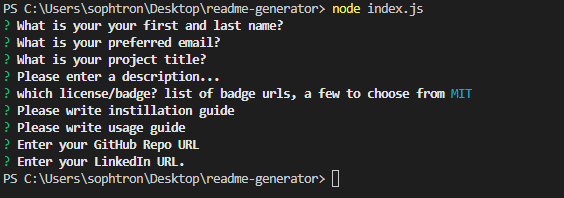

# readme-generator

## Description 

Here I have created a read me generator. Created using Node.JS and the NPM packages Inquirer, FS, and Path. The interface is through the command line using Node.js. Inquirer is used to generate the questions and responses. FS is used to create the MarkDown file and write to the document. Path is used to pass through the data. 

Testing and debugging proved to be the biggest challenge.

## Table of Contents

* [Usage](#usage)
* [Credits](#credits)
* [Features](#features)
* [License](#license)

## Usage 

## Credits

Sophia Custodia
[Linkedin](https://www.linkedin.com/in/sophia-custodia/)
[GitHub](https://github.com/Sophtron5000)

[NPM](https://docs.npmjs.com/)

## Features

* Node.JS
* NPM Packages

## License

Copyright (c) [2022] [SophiaCustodia]

Permission is hereby granted, free of charge, to any person obtaining a copy
of this software and associated documentation files (the "Software"), to deal
in the Software without restriction, including without limitation the rights
to use, copy, modify, merge, publish, distribute, sublicense, and/or sell
copies of the Software, and to permit persons to whom the Software is
furnished to do so, subject to the following conditions:

The above copyright notice and this permission notice shall be included in all
copies or substantial portions of the Software.

THE SOFTWARE IS PROVIDED "AS IS", WITHOUT WARRANTY OF ANY KIND, EXPRESS OR
IMPLIED, INCLUDING BUT NOT LIMITED TO THE WARRANTIES OF MERCHANTABILITY,
FITNESS FOR A PARTICULAR PURPOSE AND NONINFRINGEMENT. IN NO EVENT SHALL THE
AUTHORS OR COPYRIGHT HOLDERS BE LIABLE FOR ANY CLAIM, DAMAGES OR OTHER
LIABILITY, WHETHER IN AN ACTION OF CONTRACT, TORT OR OTHERWISE, ARISING FROM,
OUT OF OR IN CONNECTION WITH THE SOFTWARE OR THE USE OR OTHER DEALINGS IN THE
SOFTWARE.

